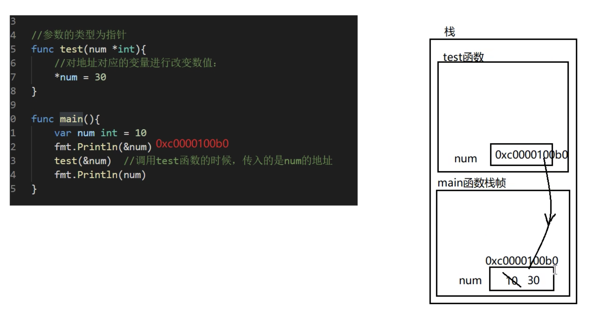

```
以值传递方式的数据类型，如果希望在函数内的变量能修改函数外的变量，可以传入变量的地址&，函数内以指针的方式操作变量。从效果来看类似于引用传递
```



```
函数也是一种数据类型，可以赋值给一个变量，则该变量就是一个函数类型的变量了。通过该变量可以对函数调用。

package main
import "fmt"

func test(num int) {
    fmt.Println(num)
}

func main() {
    // 函数也是一种数据类型，可以赋值给一个变量
    a := test // 变量就是一个函数类型的变量
    fmt.Printf("a的类型是：%T，test函数的类型是：%T \n", a, test) // a的类型是：func(int),test的函数类型是:func(int)

    // 通过该变量可以对函数调用
    a(10) //等价于  test(10)
}
```

```
函数是一种数据类型，函数可以作为形参，并且调用（把函数本身当做一种数据类型）

package main
import "fmt"

func test(num int) {
    fmt.Println(num)
}

// 定义一个函数，把另一个函数作为形参：
func test02(num1 int, num2 float32, testFunc func(int)) {
    fmt.Println("-----test02")
}

func main() {
    a := test

    // 调用test02
    test02(10, 3.19, test)
    test02(10, 3.19, a)
}
```

```
为了简化数据类型定义，GO支持自定义数据类型
基本语法：type 自定义数据类型名 数据类型
可以理解为：相当于起了一个别名
例如：type myInt int ----> 这时myInt就等价int来使用了
例如: type mySum func(int,int) int ---> 这时mySum就等价一个函数类型func(int, int) int

package main
import "fmt"

func test(num int) {
    fmt.Println(num)
}

// 定义一个函数，把另一个函数作为形参：
func test02(num1 int, num2 float32, testFunc func(int)) {
    fmt.Println("-----test02")
}

type myFunc func(int)
func test03(num1 int, num2 float32, testFunc myFunc) {
    fmt.Println("-----test03")
}

func main() {
    a := test

    // 调用test02
    test02(10, 3.19, test)
    test02(10, 3.19, a)

    // 自定义数据类型：（相当于起别名）：给int类型起了别名叫myInt类型
    type myInt int

    var num1 myInt = 30
    fmt.Println("num1",num1)

    var num2 int = 30
    num2 = num1 //虽然是别名，但是go中编译识别的时候还是认为myInt和int不是一种数据类型
    num2 = int(num1)
    fmt.Println("num2",num2)

    test03(10, 9.8, a)
}
```

```
支持对函数返回值命名

传统写法要求：返回值和返回值的类型对应，顺序不能差
func test04(num1 int, num2 int) (int, int) {
    result01 := num1 + num2
    result02 := num1 - num2
    return result01, result02
}

升级写法：对函数返回值命名，里面顺序就无所谓了，顺序不用对应
func test05(num1 int, num2 int) (sum int, sub int) {
    sum = num1 + num2
    sub = num1 - num2
    return
}
```